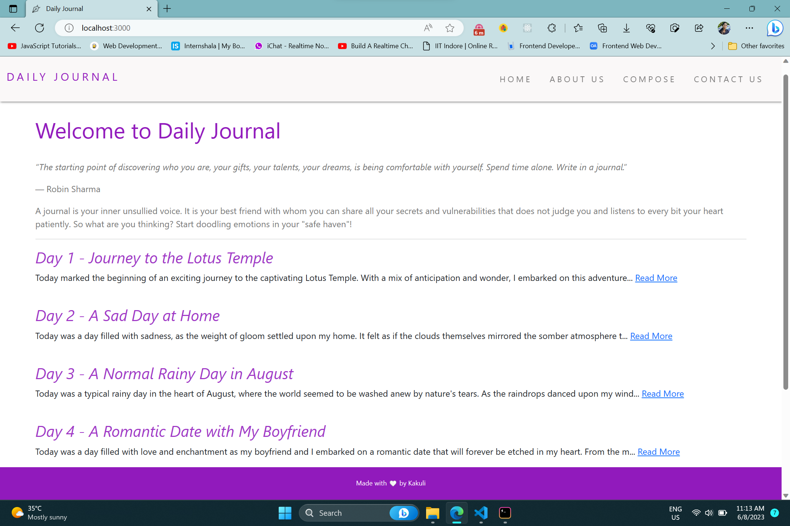
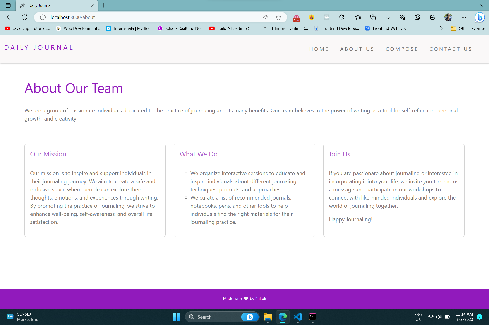

# ✒️ Daily-Journal
- 'Daily Journal' website is made for you to capture thoughts, reflect on experiences, and cultivate self-expression.
- Our mission is to inspire and support individuals in their journaling journey.

## Features
🔹Embark on your journaling journey by visiting the *Compose Page*. <br />
🔹The *Home Page* unveils a magical portal where all your cherished journals come to life. <br />
🔹To connect with like-minded individuals or for any inquiries or feedback, reach out to our dedicated team via the *Contact form*. <br />

## Live Application URL

Go to Deployed Application link 👇 <br />
<a href="https://daily-journal-7o3f.onrender.com" alt="App-link" target="_blank">Daily Journal</a> </br>

## Daily Journal Preview

### Home Page
 <br />

### About Us Page
 <br />


## Prerequisites

 ### Install Node JS
 Refer <a href="https://nodejs.org/en/" alt="node.js-link" target="_blank">Official Website</a> to download and install Node.js

 ### Install nodemon
 Install nodemon npm package globally. This will help to monitor for any changes and automatically restart server. Use the following command to install:

```
npm install -g nodemon
```

## Cloning and Running the Application in local

1. cd to the location in terminal where you want to clone the repository.

```
  cd your_path
```

2. Clone the project into the local:

```
  git clone https://github.com/Kakuli-coder/Daily-Journal.git
```

3. Go to the directory:

```
  cd Daily-Journal
```
  
4. Install all the npm packages:

```
  npm install
```

5. In order to run the application, type the following command:

```
  npm start
```


The Application runs on **localhost:3000**
